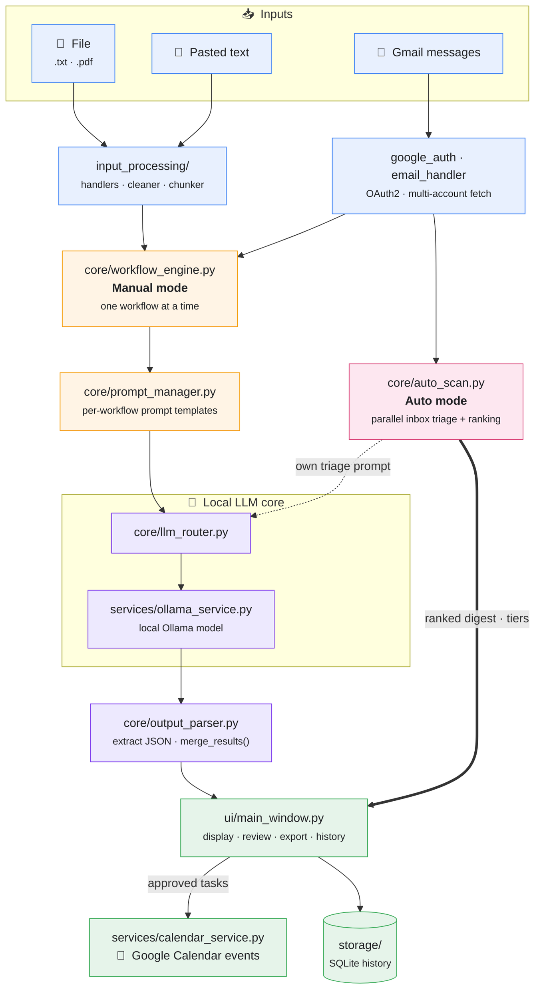

# AI Workflow Copilot

> Turn documents and Gmail messages into summaries, action items, insights, or
> side-by-side comparisons — using a **local** LLM, then push the resulting tasks
> straight to Google Calendar.

A local-first PyQt5 desktop app powered by a local [Ollama](https://ollama.com)
model. Your documents and emails never leave your machine — the LLM runs locally.


-000000)


<!-- DEMO: record a ~30s clip of one full workflow, convert to GIF, save as
     docs/demo.gif, then uncomment the line below.

-->

---

## What this project demonstrates

A complete local-first AI pipeline built end to end:

- **Local LLM orchestration** — chunk long inputs, prompt a local Ollama model per
  workflow, parse the JSON it returns, and merge results across chunks.
- **Responsive desktop UI** — PyQt5 with workflows running on a background `QThread`
  so the interface never freezes (runs are cancellable mid-flight).
- **Real OAuth integration** — multi-account Google sign-in (Gmail read + Calendar
  write) with per-account token storage and refresh.
- **Privacy by design** — documents and email bodies are processed by a model
  running on the user's own machine; nothing is sent to a third-party API.

> **Note — this is a local-first desktop app, so there is no hosted "try it" demo.**
> It needs Ollama and a model running locally plus your own Google credentials. The
> GIF above and the screenshots below show it in action.

---

## Screenshots

<!-- Capture these while the app is running and save them under docs/screenshots/ -->

**Main window**


**Task review dialog**


**Run history**


**Settings**


---

## Features

- **Four workflows** — Summary, Tasks, Insights, Compare
- **Auto mode (inbox triage)** — one click scans your most recent emails,
  triages each in parallel against the local LLM, and ranks them into
  high / medium / low urgency tiers — then push the important tasks to
  Calendar in bulk (see [Auto mode](#auto-mode) below)
- **Multi-source input** — paste text, drag-and-drop `.txt` / `.pdf`, batch
  upload, or fetch Gmail messages with native search syntax
  (`from:`, `subject:`, `is:unread`, …)
- **Multi-account Google sign-in** — add, switch, and remove Google accounts
  from the header dropdown; tokens are stored per account under `tokens/`
- **Task review dialog** — edit task title, deadline, and priority, or uncheck
  rows to skip, before any Calendar events are created
- **Tasks classifier** — returns a `source_type` label so narrative, reddit
  threads, and reference material don't get turned into fake action items
- **Cancellable runs** — the Process button doubles as Cancel during a run
- **Run history** — every result is stored in a local SQLite database and is
  searchable / reloadable in-app
- **TXT / CSV export**

---

## Auto mode

Manual mode answers *"analyse this one thing I gave you."* **Auto mode** answers
the more useful question: *"what in my inbox actually needs me right now?"*

Switch the **Mode** dropdown from *Manual* to *Auto*, pick a time window, and hit
**Scan**. The app then:

1. **Fetches** your most recent emails in the chosen window
   (`4 / 12 / 24 / 48` hours, newest first, capped at 15).
2. **Triages each email in parallel** — every message gets one lean, direct LLM
   call (no chunker; bodies are truncated to the first ~150 words, where most of
   the actionable signal lives). Calls run on a small thread pool so the inbox is
   scanned concurrently rather than one-at-a-time.
3. **Ranks** the results into **high / medium / low / none** tiers. The tier comes
   from the model's own urgency rating, with a cheap deterministic score
   (task priority + deadline urgency) as a tie-breaker for ordering within a tier.
4. Presents a ranked **digest** — the emails most likely to need action float to
   the top, each with its extracted tasks.

From the digest you can **push all high/medium tasks to Calendar in one click**,
so a noisy inbox becomes a short, prioritised to-do list without reading every
message yourself.

> Auto mode is deliberately separate from the manual workflow pipeline: it uses
> its own compact triage prompt and tight LLM options (small context window,
> capped output tokens) so scanning a dozen emails stays fast on a local model.

---

## Architecture

Two paths share one local-LLM core. **Manual mode** runs a single chosen
workflow through the orchestrator; **Auto mode** fans recent emails out for
parallel triage and ranking.



The **pink** node is Auto mode, the **amber** nodes are Manual mode, and both
feed the shared **purple** local-LLM core before results land in the UI.

---

## Tech stack

**Python** · **PyQt5** (desktop UI) · **Ollama** + Mistral (local LLM) ·
**Google Gmail & Calendar APIs** (OAuth2) · **PyMuPDF** (PDF parsing) ·
**SQLite** (run history) · **pytest** + **ruff**

---

## Setup

### 1. Clone and create a virtual environment

```bash
git clone <repo-url>
cd ai_workflow_copilot
python -m venv venv
venv\Scripts\activate      # Windows
# source venv/bin/activate # macOS / Linux
pip install -r requirements.txt
```

### 2. Configure environment variables

```bash
cp .env.example .env
```

Edit `.env`:

```
GMAIL_CLIENT_SECRET=client_secret.json
OLLAMA_URL=http://localhost:11434/api/generate
OLLAMA_MODEL=mistral
CHUNK_SIZE=300
```

### 3. Start Ollama

```bash
ollama serve
ollama pull mistral
```

### 4. Run

```bash
python main.py
```

---

## Google setup

1. Open the [Google Cloud Console](https://console.cloud.google.com/) and
   create (or reuse) a project.
2. Enable **Gmail API** and **Google Calendar API** for that project.
3. Create OAuth 2.0 credentials (Application type: **Desktop app**) and
   download the JSON.
4. Save the JSON somewhere in the project folder and point
   `GMAIL_CLIENT_SECRET` in `.env` at it.
5. Launch the app and use the **Account** dropdown in the header → *"Add
   account…"* to complete the OAuth flow in the browser. Tokens are saved
   under `tokens/<email>.pkl`.

Required scopes:

- `https://www.googleapis.com/auth/gmail.readonly`
- `https://www.googleapis.com/auth/calendar.events`
- `https://www.googleapis.com/auth/userinfo.email`
- `openid`

---

## Output schemas

**Summary**
```json
{ "summary": "..." }
```

**Tasks**
```json
{
  "source_type": "actionable | narrative | discussion | informational",
  "action_items": [
    { "task": "...", "deadline": "...", "priority": "high|medium|low" }
  ]
}
```

**Insights**
```json
{ "key_insights": ["..."] }
```

**Compare**
```json
{
  "summary": "...",
  "common_themes": ["..."],
  "differences": ["..."],
  "key_insights": ["..."]
}
```

---

## Keyboard shortcuts

| Shortcut | Action |
|---|---|
| `Ctrl+Enter` | Run the selected workflow (or cancel if running) |
| `Ctrl+O` | Open files |
| `Ctrl+E` | Fetch emails |
| `Ctrl+S` | Export result as TXT |
| `Ctrl+Shift+S` | Export result as CSV |
| `Ctrl+,` | Open Settings |
| `Ctrl+L` | Clear input |

---

## Testing

```bash
python -m pytest tests/ -v
```

Sample PDFs for manual testing of each workflow can be generated with:

```bash
python tests/generate_test_pdfs.py
```

They land in `tests/test_pdfs/` (gitignored).

---

## Project layout

```
ai_workflow_copilot/
├── config/             settings + persisted preferences
├── core/               workflow engine, LLM router, prompts, output parser
├── exports/            TXT / CSV exporters
├── input_processing/   file handlers, Gmail, OAuth, cleaner, chunker
├── services/           Ollama and Google Calendar clients
├── storage/            SQLite history
├── tests/              unit tests + PDF fixture generator
├── ui/                 PyQt5 main window, settings, task review dialog
├── utils/              logger and small helpers
├── main.py             entry point
├── requirements.txt
└── .env.example
```

---

## License

MIT — see [`LICENSE`](LICENSE).
